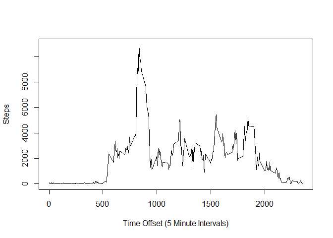

# Reproducible Research: Peer Assessment 1
## Loading and preprocessing the data


```r
## Loading and preprocessing the data

## Since the zip is included in the repo, let's check and unzip it.
if(!file.exists("activity.csv"))
  {
    if(file.exists("activity.zip"))
    {
      unzip("activity.zip")
    } ## else we could download it but... 
    ##  it should be handled manually at this point.
  } ## else we are good to go.

## Load the file in and store.

activity_raw <- read.csv("activity.csv", colClasses = c("integer", "Date", "integer"))
```

## What is mean total number of steps taken per day?
\

```
## [1] "Mean:  10766.1886792453"
```

```
## [1] "Median: 10765"
```

## What is the average daily activity pattern?
### If not too difficult, convert these to times of day

```r
act_nona <- na.omit(activity_raw) ## pesky NAs!
ac_interval <- aggregate(x = act_nona$steps, FUN = sum, by = list(act_nona$interval))

plot(ac_interval, type = "l", xlab= "Time Offset (5 Minute Intervals)", ylab = "Steps")
```

\

```r
act_nona_sort <- ac_interval[order(ac_interval$x, decreasing = TRUE),]
## 835 is a modified clock time, not 835 minutes after midnight

print(paste("Most active period:", act_nona_sort$Group.1[1]))
```

```
## [1] "Most active period: 835"
```

```r
print(paste("Number of steps at most active:", act_nona_sort$x[1]))
```

```
## [1] "Number of steps at most active: 10927"
```

## Imputing missing values
### Note to self: imputing is not a typo like you thought the first time.
### Still TODO.

## Are there differences in activity patterns between weekdays and weekends?

```r
## Skipping the NAs again because I don't feel comfortable creating them, even with simple methods.
act_nona_days <- na.omit(activity_raw) ## remove NA from raw data
act_nona_days$dayofweek <- weekdays(act_nona$date)
act_nona_days$weekend <- ifelse(act_nona_days$dayofweek == "Saturday" | act_nona_days$dayofweek == "Sunday", TRUE, FALSE )
```
